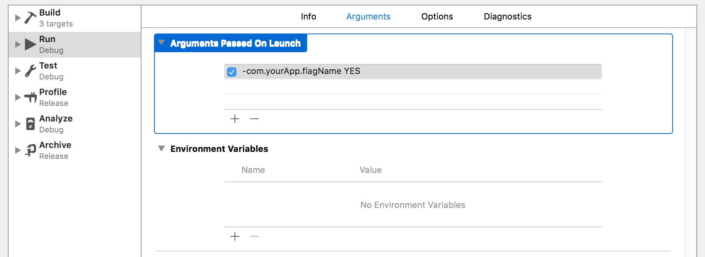

## Overriding UserDefaults for development

When you need a flag, or some lite configuration data, it's easy to reach for UserDefaults. It's usually more than enough to deal with simple flags for requesting push notification, new user setup, data migrations and so on. UserDefaults are great -- until it comes time to test out whatever is behind that flag.

Here's a pretty common scenario you've probably run in to before: You want to introduce a new feature to users, but you're a thoughtful developer and choose to alert your users just once. There's nothing more to it other than a simple check for existence, so you add a key to UserDefaults and call it a day.

```swift
fileprivate let widgetEnablerKey = "com.yourapp.widgetEnablerShown"

let hasSeenFeatureAlert = UserDefaults.standard.bool(for: widgetEnablerKey)
if hasSeenFeatureAlert != true { showFeatureAlert() }
func showFeatureAlert() {
  // Alert: "New Feature Available"
  UserDefaults.standard.setValue(true, for: widgetEnablerKey)
}
```

Now you get a new request to add some animation to the presentation of your new feature, and so you'll want to be able to demo and test that without too much pain. Now that handy persistence you get from UserDefaults is a bit of an annoyance. Should you add a #debug flag that automatically deletes that key while you test and hope you remember not to check it in? How about a temporary override that won't get picked up by version control?

## Enter The Argument Domain:

If you've ever taken a deep dive in to the details of how UserDefaults works, or looked more closely at the code completion in Xcode, you've probably noticed that the concept of "Domains", and that the domains may be volatile or persistent. There is also a search order that is followed when a key is requested -- and this is what we're going to leverage to help you test your code a little more quickly.

There are a total of 5 domains that are potentially checked for a default, and you can [dig in to all of them in the documentation](https://developer.apple.com/library/content/documentation/Cocoa/Conceptual/UserDefaults/AboutPreferenceDomains/AboutPreferenceDomains.html#//apple_ref/doc/uid/10000059i-CH2-SW1) but for now we're going to focus on the three most useful for iOS developers:

### The Application Domain -- Where most of your defaults probably live right now

The Application domain is the default domain where data is read from and persisted to if you're using code that looks like this:

```swift
UserDefaults.standard.bool(for: "myFlag")
UserDefaults.standard.set(true, for: "myFlag")
```

### The Registration Domain -- If you need a default for your default, this is where it goes

Let's say we wanted to shake things up a bit, and use a flag that indicates that the new feature alert _should_ be shown. We can use the registration domain to set a last-resort fallback value for the key we want to access that will be ignored once we've explicitly set a value in the Application domain. 

```swift
fileprivate let widgetEnablerKey = "com.yourapp.showWidgetEnabler"

// In `application(_ application: UIApplication, didFinishLaunchingWithOptions launchOptions: [UIApplicationLaunchOptionsKey : Any]? = nil)`
  
UserDefaults.standard.register([ widgetEnablerKey: true ])

let shouldShowFeatureAlert = UserDefaults.standard.bool(for: widgetEnablerKey)

if shouldShowFeatureAlert { showFeatureAlert() }

func showFeatureAlert() {
  // Alert: "New Feature Available"
  UserDefaults.standard.setValue(false, for: widgetEnablerKey)
}
```

Using `register(defaults registrationDictionary: [String : Any])` will load values in to the registration domain, and if a value is not found in the application domain, the value from the registration domain will be returned instead -- so consider them UserDefault defaults.

One important caveat is that the Registration domain is "volatile" -- this means that you'll need to register your defaults on each app launch since the registration domain is not persisted and thus, a clean slate each time you re-launch the app.

### The Argument Domain - Where you set a flag that you don't want to change (sort of)

The argument domain is a special one: it loads up values directly from the application launch options, or as they're called in your Xcode schemes -- "Arguments Passed On Launch".



The argument domain is the first place that is checked when requesting a value from user defaults -- this makes it particularly suited for our use case since it will override values already stored in the Application domain. To override a specific user default value, you specify it as follows:

```sh
-com.yourapp.showWidgetEnabler YES
```

You can check your work by specifically looking at the Argument domain:

```swift
let argumentOverrides = UserDefaults.standard.volatileDomain(forName: UserDefaults.argumentDomain) // [ String: Any]
dump(argumentOverrides)
```

Now that the flag is forced to be true, you can revisit your view over and over without needing to hit the debugger or relaunch the application just to reset the value.

Of course, you'll have this value in your Scheme which means it'll show up in version control -- but there's a pretty simple fix for that: Just duplicate your scheme and don't mark it as shared (you do have a good `.gitignore` that doesn't track user schemes, right? ;)). 

Wouldn't it be nice if there was some way to have that available somewhere that doesn't require a separate scheme? Well, it can definitely be done -- and we'll cover _that_ in part 2 :)
